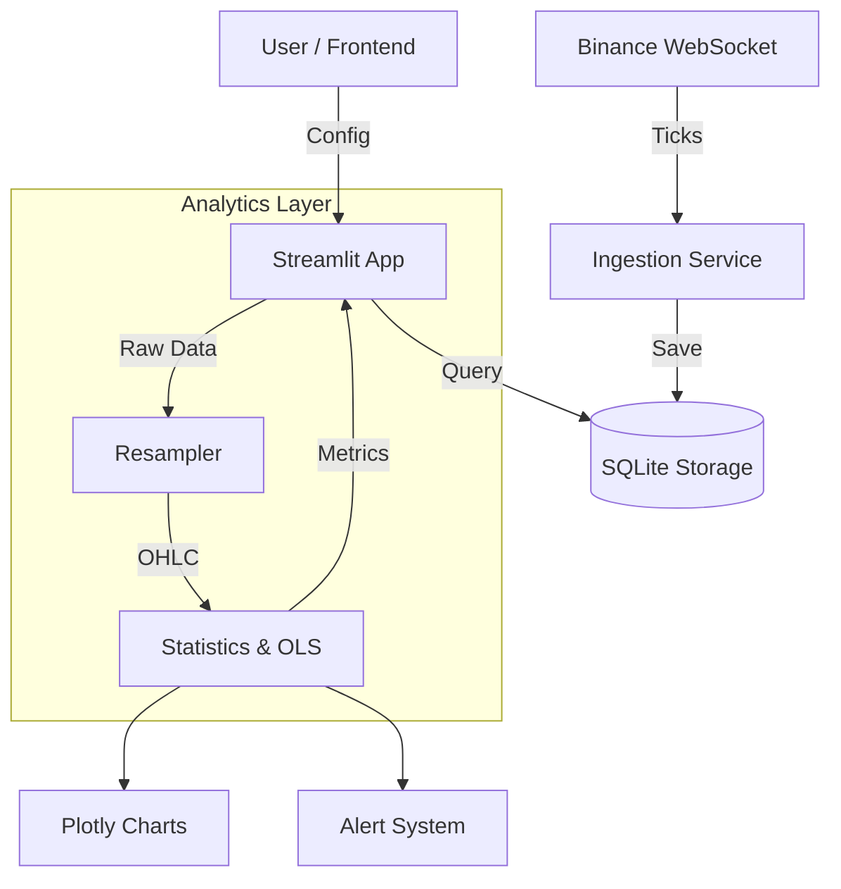

# Quant Analytics Dashboard

A real-time quantitative analytics dashboard for cryptocurrency tick data.

## Features
- **Real-time Data Ingestion**: Connects to Binance WebSocket for live trade data (e.g., BTCUSDT, ETHUSDT).
- **Storage**: SQLite-based local storage for tick data.
- **Analytics**:
  - Resampling (1s, 1m, 5m).
  - Basic Stats (Mean, Variance, Returns).
  - Hedge Ratio (OLS Beta).
  - Spread & Z-Score (Rolling).
  - Augmented Dickey-Fuller (ADF) Test for stationarity.
  - Rolling Correlation.
- **Frontend**: Interactive Streamlit dashboard with live updates, charts, and alerts.

## Project Structure
```
quant_dashboard/
├── data/               # SQLite database (market_data.db)
├── src/
│   ├── analytics.py    # Math & Stats logic
│   ├── app.py          # Streamlit Dashboard
│   ├── config.py       # Configuration
│   ├── ingestion.py    # Binance WebSocket Client
│   └── storage.py      # Database Interface
├── run.py              # Entry point
├── requirements.txt    # Dependencies
└── README.md
```

## Setup & Running

1. **Install Dependencies**:
   ```bash
   pip install -r requirements.txt
   ```

2. **Run Application**:
   ```bash
   python run.py
   ```
   Or directly:
   ```bash
   streamlit run src/app.py
   ```

3. **Usage**:
   - The app will automatically connect to Binance ticks on start.
   - Use the Sidebar to select symbols (pair trading X vs Y).
   - Adjust "Rolling Window" and "Timeframe".
   - Watch the charts update in real-time.

## Architecture



### Components
1. **Ingestion (`ingestion.py`)**: Runs in a background thread (managed by Streamlit cache). Connects to `wss://stream.binance.com:9443` and buffers trades to SQLite.
2. **Storage (`storage.py`)**: Manages `market_data.db`. Tables indexed by symbol and timestamp for fast range queries.
3. **Analytics (`analytics.py`)**: Stateless function library. Computes Z-Scores, ADF tests, and spreads on pandas DataFrames.
4. **Frontend (`app.py`)**: Refreshes periodically. Fetches recent data, computes analytics on-the-fly, and renders visualization.

## Methodology

- **Pair Trading**: The dashboard is designed to analyze cointegration between two assets (Y and X).
- **Hedge Ratio**: Calculated via OLS regression: $Y = \alpha + \beta X + \epsilon$.
- **Spread**: $Spread = Y - \beta X$.
- **Z-Score**: $(Spread - \mu_{window}) / \sigma_{window}$.
- **ADF Test**: Checks if the spread is stationary (mean-reverting). p-value < 0.05 suggests stationarity.

## AI Usage Note
This project was implemented with the assistance of an AI agent (Google Deepmind) to accelerate boilerplate generation, architectural planning, and statistical logic verification.

